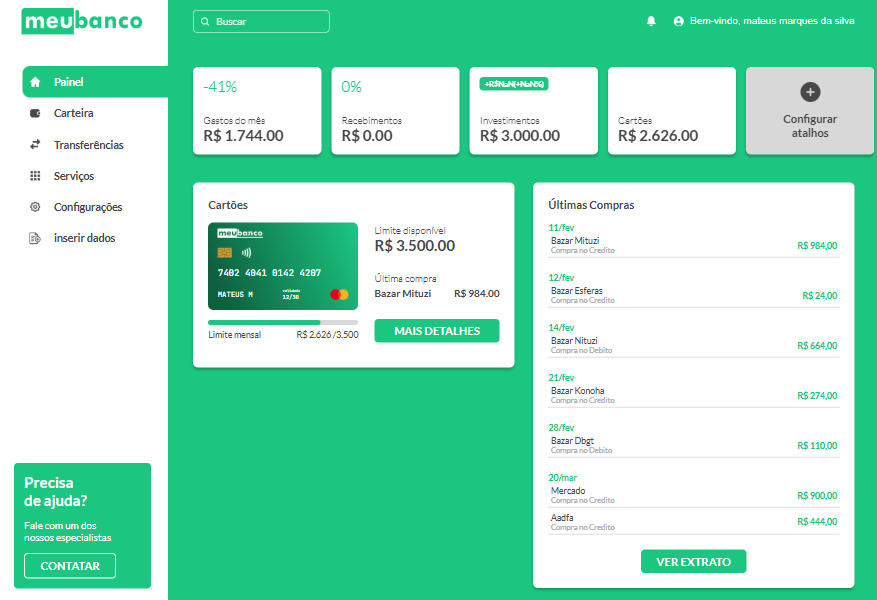
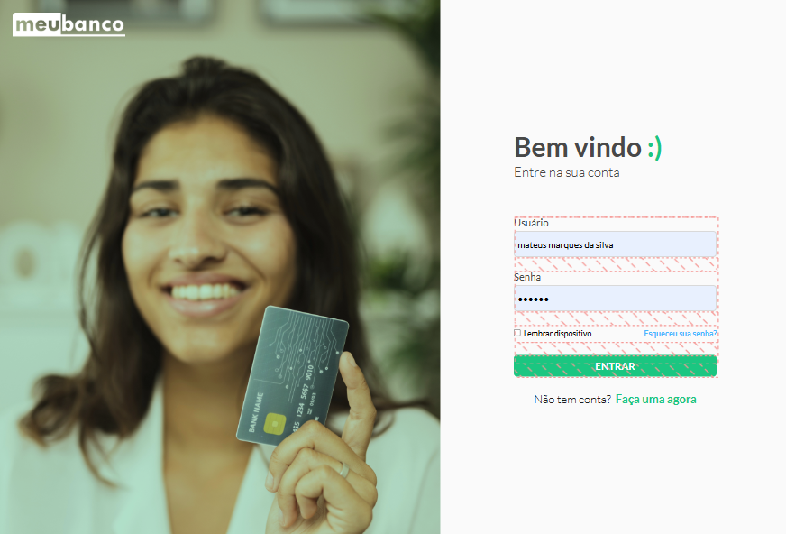

<h1 align="center" style="font-weight: bold;">Banco Digital 💻</h1>

<p align="center">
 • <a href="#sobre">Sobre</a> 
 • <a href="#funcionalidades">Funcionalidades</a>  
 • <a href="#tecnologias-utilizadas">Tecnologias Utilizadas</a>
 • <a href="#instalação">instalação</a> 
 • <a href="#como-usar">Como Usar</a>  
 • <a href="#contribuição"> Contribuição</a>
 • <a href="#licença"> Licença </a> 
</p>

<p align="center">
    <b>Uma aplicação web que simula um banco digital, permitindo aos usuários realizar transações, gerenciar investimentos, efetuar pagamentos de faturas e muito mais.</b>
</p>

<p align="center">
     <a href="PROJECT__URL">📱 Ver Projeto </a>
</p>

<h2 id="layout">🎨 Layout</h2>

<p align="center">
    
    
</p>

<h2 id="sobre">💡Sobre</h2>

O **Banco Digital** é um projeto que permite simular operações bancárias de forma simples e intuitiva, proporcionando uma experiência semelhante à de um banco real. A aplicação permite que os usuários:

- Efetuem transações (depósitos e transferências);
- Realizar compras no credito e no debito
- visualizar e pagar faturas geradas
- Realizar investimentos acompanhem seus rendimentos;
- Visualizem o extrato e o histórico de operações.
- visualizar status do cartao (saldo faturas etc...)

<h2 id="technologies">💻 Technologias Utilizadas</h2>

- **HTML5**
- **CSS3**
- **JavaScript (ES6+)**

<h2 id="started">⚙️ Instalaçao </h2>

Siga os passos abaixo para rodar o projeto localmente:

<h3>1. Clone o repositório</h3>

```bash
git clone https://github.com/mateus073/Meu-Banco.git
```

<h3>2. Abra a pasta do projeto:</h3>

```bash
cd Meu-Banco
```

<h3>3. Abra o arquivo index.html no seu navegador:</h3>

  Você pode simplesmente clicar duas vezes no arquivo ou utilizar uma extensão do VS Code, como "Live Server", para visualizar o projeto.

```bash
cd Meu-Banco
npm some-command-to-run
```


<h2 id="como-usar">📚 Como Usar </h2>

<h3>1.  Acesse a página principal</h3>

- Ao abrir o index.html, você será direcionado para a página de login onde voce pode clicar no link de criar conta caso nao tenha ou logar na sua conta caso ja tenha conta salva.

<h3> 2. Navegue entre as funcionalidades</h3>
 
 - Utilize o menu para acessar transações, compras, investimentos e pagamento de faturas etc...


<h3>3. Realize operações</h3>  

  - Se for a primeira vez que você está logando, acesse a aba Inserir Dados.
  - Preencha os formulários com as informações necessárias para cada operação.
  - Siga as instruções e mensagens de validação exibidas na tela.
  


<h3>4. Verifique os resultados</h3>

  - Os dados inseridos são armazenados no localStorage e atualizados conforme cada operação realizada.
  - Atualize a página e navegue pelas abas para conferir os resultados.


<h2 id="funcionalidades">⚡ Funcionalidades</h2>
  
  <h3> Cadastro e Login </h3>
      
  - Após o cadastro, um objeto de usuário é criado e adicionado a um array de usuários armazenado no Local Storage.

  - Um ID único é gerado para identificar cada usuário, facilitando o acesso ao usuário logado mesmo com múltiplos registros.

  - Também é possível recuperar a senha caso tenha sido esquecida.

  - Após concluir o cadastro, efetue o login com seu usuário.

  <h3> Transações</h3>

  - Na aba "Inserir Dados", você pode adicionar transações.

  - Registre uma transação selecionando o tipo (recebida ou enviada), informando o valor, a 
  data da operação e o nome da pessoa envolvida.

  - Após o registro, os dados do usuário (saldo, histórico de transações, etc.) são atualizados no local storage.

  - Atualize a tela para visualizar as alterações nas demais abas.
  

  <h3> Compras e Faturas</h3>
    
 - Na aba "Inserir dados", você pode adicionar suas compras.

 - Registre uma compra selecionando o tipo (crédito ou débito.), informando o valor, a data da operação e o nome do estabelecimento, e se for no credito a quntidade de parcelas. 

 - Para compras no crédito, o valor será adicionado à fatura atual. Caso não exista uma fatura em aberto, uma nova será gerada e as parcelas serão adicionadas a ela.

 - Para compras no débito, o valor será deduzido diretamente do saldo disponível.

 - Após o registro, os dados do usuário, como saldo, histórico de transações e faturas, são atualizados automaticamente no local Storage.

 - Atualize a tela para visualizar as alterações nas abas correspondentes.
  
  <h3> Investimentos </h3>

 - Na aba "Inserir dados", você pode adicionar investimentos .

 - Informe o valor a ser investido e escolha a modalidade desejada (Ações ou titulos) o valor a data e o nome da empresa.

 - O valor será deduzido diretamente do saldo disponível no momento da aplicação.

 - Detalhes do investimento, como data, valor e modalidade, serão adicionados ao histórico de investimentos.

 - Após o registro, os dados do usuário (saldo e investimentos) serão atualizados automaticamente no local storage.

 - Atualize a tela para visualizar as informações nas abas relacionadas.
  
  <h3>Pagamento de Faturas</h3>
   
   - Na aba "Inserir dados", você pode quitar sua fatura de crédito.

  - Selecione a fatura em aberto que deseja pagar (por mês).

  - Após o pagamento, o valor será deduzido diretamente do saldo disponível, e o limite de crédito será restaurado. Se o saldo não for suficiente, uma mensagem de erro será exibida.

  - Os dados do usuário, como saldo e status da fatura, serão atualizados automaticamente no Local Storage.

  - Atualize a tela para visualizar as alterações nas abas relacionadas.

  <h3>Criação e manipulação de dados de atalho</h3>

  - Exibe os Dados dos Atalhos:
    - Exibe informações financeiras como gastos, recebimentos, investimentos, saldo e empréstimos.
    - Calcula e exibe as variações percentuais entre o mês atual e o mês anterior.

  - Gerenciamento dos Atalhos Personalizáveis:
    - Cria dinamicamente os itens de atalho com base nas preferências do usuário.
    - Permite alternar a visibilidade dos atalhos (limite de 4 visíveis) e salva as preferências no Local Storage.
    
  - Persistência e Atualização de Configurações:
    - Salva as alterações do usuário no localStorage, garantindo que as configurações sejam mantidas em futuras sessões.

  <h3>Exibe os dados do cartao e das compras</h3>
    
  - Atualiza informações do cartão ativo, como número, nome e validade etc..
    
  - Exibe dados do limite, incluindo total de compras no crédito, porcentagem utilizada e limite disponível.
    
  - Atualiza a visualização da fatura atual, mostrando valor, limite disponível, data de fechamento e barras de status (verde, azul e laranja) que indicam diferentes valores.
  
  - Exibição e Organização das Compras
    
    - Ordena e exibe as compras por data, destacando a compra mais recente.
      
    - Agrupa as compras por data, criando seções dinâmicas com cabeçalhos (datas formatadas) e listas de itens.
      
    - Limita inicialmente a exibição a 7 itens, com opção de expandir ou recolher a lista via botão "VER EXTRATO"/"VER MENOS".

  <h3>Interface Responsiva</h3>

  - Design adaptado para diferentes dispositivos  utilizando HTML e CSS.

<h2 id="statusProjeto">🚀 Status do Projeto</h3>

Este projeto está em fase de desenvolvimento, com diversas funcionalidades sendo implementadas e aprimoradas. Algumas das principais áreas em desenvolvimento incluem:

 - **Aba de Carteira*:* Permite visualizar faturas, verificar status, ajustar limites de cartões e gerenciar outros dados relacionados à conta.

- **Aba de Transferências:** O usuário pode consultar o histórico de transferências, registrar chaves Pix e gerenciar suas transações.

- **Aba de Serviços:** Disponibiliza serviços exclusivos para o usuário, como opções de pagamento e outras funcionalidades.

- **Aba de Configurações:** Permite ajustes nas configurações da conta do usuário, como preferências e dados pessoais.

- **Sistema de Busca:** Facilita o acesso às funcionalidades do site através de uma barra de busca, sem necessidade de navegar pelas abas.

- **Integração com API:** O projeto está sendo adaptado para consumir dados de uma API, integrando os usuários e outras informações externas.

Estamos trabalhando para melhorar a experiência do usuário e garantir que todas as funcionalidades estejam funcionando de forma eficiente.


<h2 id="colab">🤝 Colaboradores</h2>

Um agradecimento especial a todas as pessoas que contribuíram para este projeto.
<table>
  <tr>
    <td align="center">
      <a href="#"><br>
        <sub>
          <b>Mateus Marques</b>
        </sub>
      </a>
    </td>
    <td align="center">
      <a href="#">
        <br>
        <sub>
          <b>Elon Musk</b>
        </sub>
      </a>
    </td>
  </tr>
</table>
